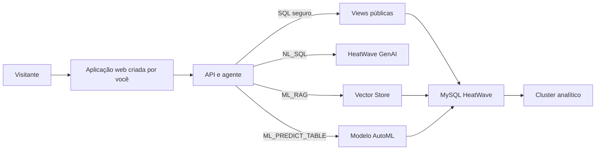

# 0. Visão geral e pré-requisitos

## Arquitetura alvo

O MySQL HeatWave é a fonte de verdade para dados, analytics, ML e vetores. O
agente não recebe credenciais e não executa SQL sem validação no backend.

## Pré-requisitos

- Conta OCI com permissão de criar MySQL HeatWave DB System, rede e, para RAG,
  Object Storage e OCI Generative AI.
- MySQL Shell ou MySQL Shell for VS Code.
- Node.js 20+ somente para construir a aplicação na etapa 6.
- Acesso ao Kaggle para baixar os CSVs.

## Papéis

1. **admin/deployment** cria schemas, importa, carrega no cluster, treina e
   cria o Vector Store.
2. **app_readonly** recebe somente `SELECT` e `SHOW VIEW` em
   `fraud_demo_public`.
3. **app_genai** é opcional e recebe apenas os `EXECUTE` necessários para as
   rotinas GenAI da sua versão.

Nunca use a conta administrativa na aplicação.

## Critérios de pronto

- uma agregação no cluster analítico;
- uma pergunta que gera SQL seguro;
- uma predição de uma nova transação;
- uma pergunta RAG com citações;
- bloqueio de DDL, DML e SQL multi-instrução.
