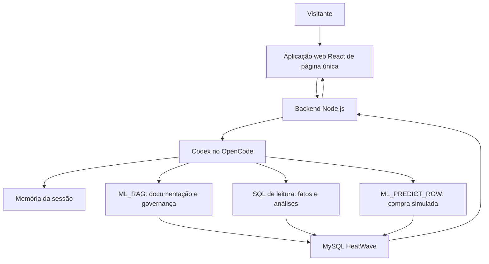

# Laboratório FEBRABAN - investigação de risco com MySQL HeatWave e IA

Data de referência: 23/08/2026
Modelo de risco: `febraban_fraud_manual_xgb_b1_final_v2_20260810`
Finalidade: documento de referência para RAG, OpenCode/Codex e apresentação da demonstração.

## 1. O case em uma frase

O laboratório demonstra como uma equipe de fraude pode explorar dados, consultar um modelo preditivo e recuperar documentação técnica em linguagem natural, mantendo o MySQL HeatWave como a fonte de dados, analytics, vetores e Machine Learning.

O visitante conversa em português; o agente decide se a resposta depende de SQL, de uma simulação de score ou de documentação. A experiência é demonstrativa, com dados sintéticos e banco de leitura.

> Linguagem obrigatória: `is_fraud = 1` é um rótulo histórico sintético. Uma previsão do modelo é um **alerta de risco**, nunca uma confirmação de fraude, bloqueio ou decisão sobre uma pessoa.

## 2. A base pública usada

Fonte: [Credit Card Transactions Fraud Detection Dataset no Kaggle](https://www.kaggle.com/datasets/kartik2112/fraud-detection/data). O dataset foi gerado pelo simulador Sparkov e contém transações sintéticas de cartão entre 01/01/2019 e 31/12/2020.

O Kaggle disponibiliza os arquivos `fraudTrain.csv` e `fraudTest.csv`. No laboratório, ambos foram carregados em `fraud_demo.transactions_raw`, preservando a origem em `source_split`.

| Split | Transações | Rótulos `is_fraud = 1` | Período |
| --- | ---: | ---: | --- |
| `train` | 1.296.675 | 7.506 | 01/01/2019 a 21/06/2020 |
| `test` | 555.719 | 2.145 | 21/06/2020 a 31/12/2020 |
| **Total** | **1.852.394** | **9.651** | **01/01/2019 a 31/12/2020** |

Apenas cerca de 0,521% dos registros têm rótulo 1. Essa assimetria é central para a demonstração: uma acurácia alta por si só não prova que o modelo detecta bem os casos de interesse. Por isso exibimos precisão, recall, F1, ROC AUC e volume de alertas.

### 2.1 O que cada coluna significa

| Grupo | Colunas | Finalidade na demo |
| --- | --- | --- |
| Identificação da transação | `transaction_id`, `trans_num`, `unix_time`, `source_split` | Auditoria, rastreabilidade, split; não entram no score B1. |
| Tempo e compra | `trans_date_trans_time`, `merchant`, `category`, `amt` | Investigação SQL; `category` e derivações de valor/hora participam do B1. |
| Cliente sintético | `cc_num`, `first_name`, `last_name`, `gender`, `street`, `city`, `state`, `zip`, `city_pop`, `job`, `dob` | Exploração agregada e auditoria controlada. Dados identificáveis sintéticos não devem ser expostos sem necessidade. |
| Geografia sintética | `customer_lat`, `customer_long`, `merch_lat`, `merch_long` | Calculam a distância cliente-estabelecimento. |
| Rótulo | `is_fraud` | Rótulo histórico sintético; target de treino, nunca entrada da nova predição. |

Não há produtos ou itens vendidos no Sparkov. Há estabelecimentos sintéticos, categorias, valores, tempo, clientes sintéticos e localização. Perguntas como “qual produto vendeu mais?” devem ser recusadas ou redirecionadas para categoria ou merchant.

## 3. MySQL HeatWave no laboratório

O MySQL HeatWave é a plataforma central do case:

| Capacidade | Papel na demonstração |
| --- | --- |
| MySQL | Armazena a origem, features, resultados de score, documentos e registros de avaliação. |
| HeatWave Cluster analítico | Acelera filtros, agregações, rankings e comparações em grandes volumes de transações. |
| SQL | Produz evidência auditável para perguntas sobre totais, categorias, merchants, regiões e casos. |
| HeatWave AutoML | Treina e executa o classificador de risco dentro da plataforma. |
| HeatWave GenAI / Vector Store | Indexa documentos e permite `ML_RAG` com citações. |

O cluster analítico permite que a mesma base operacional seja usada para análises sem exportar CSVs a cada pergunta. Na demo, consultas de dados são somente leitura, limitadas e exibidas ao visitante.

## 4. Modelo de Machine Learning de risco

O modelo atual é um classificador binário `XGBClassifier`, treinado com `sys.ML_TRAIN` no HeatWave para estimar a probabilidade da classe associada ao rótulo sintético `is_fraud = 1`.

### 4.1 Features efetivamente usadas

O B1 V2 ativo usa estas sete colunas, confirmadas no catálogo
`ML_SCHEMA_febraban.MODEL_CATALOG`:

```text
amount
amount_log
category
customer_merchant_distance_km
transaction_hour
weekday_number
is_weekend
```

| Feature | Definição |
| --- | --- |
| `amount` | `CAST(amt AS DECIMAL(14,2))` |
| `amount_log` | `LN(1 + amount)`, para reduzir a assimetria de valores |
| `category` | Categoria sintética da compra |
| `customer_merchant_distance_km` | Distância Haversine entre cliente e merchant sintéticos |
| `transaction_hour` | Hora extraída de `trans_date_trans_time` |
| `weekday_number` | Dia da semana: segunda-feira = 0 e domingo = 6 |
| `is_weekend` | Indicador derivado de sábado ou domingo |

`transaction_id` e `transaction_timestamp` são campos de auditoria. `is_fraud` é o target que o modelo tenta estimar; portanto, não deve ser enviado a uma predição.

### 4.2 Separação temporal e avaliação

O arquivo `test` permaneceu isolado até o final. Dentro de `train`, o desenvolvimento usou transações anteriores a `2020-03-06 07:16:43` e a validação usou o período posterior.

O treinamento final usou as 1.296.675 linhas de `fraud_ml.features_manual_b1_train_full_v2`, foi otimizado por F1 e levou aproximadamente 80,6 minutos. Para o laboratório, o threshold operacional único é `0,60`.

| Métrica | Validação temporal | Teste final isolado |
| --- | ---: | ---: |
| Precisão | — | 83,30% |
| Recall | — | 61,86% |
| F1 | — | 0,7100 |
| ROC AUC | 0,9967 | 0,9947 |
| Alertas | — | 1.593 |
| TP / FP / TN / FN | — | 1.327 / 266 / 553.308 / 818 |

No teste final no corte de 60%, 1.327 dos 1.593 alertas coincidiram com rótulo sintético 1; 818 registros com rótulo 1 ficaram abaixo do threshold. Esta é a escolha de operação adotada para o laboratório entre cobertura e volume para revisão humana.

### 4.3 Predição de uma nova compra

Para simular uma compra, o agente monta exatamente as sete features usadas no
treino e chama `ML_PREDICT_ROW`:

```sql
CALL sys.ML_PREDICT_ROW(
  JSON_OBJECT(
    'amount', 1200.00,
    'amount_log', LN(1201.00),
    'category', 'shopping_net',
    'customer_merchant_distance_km', 15.8,
    'weekday_number', 2,
    'is_weekend', 0,
    'transaction_hour', 2
  ),
  'febraban_fraud_manual_xgb_b1_final_v2_20260810',
  @prediction
);
SELECT @prediction;
```

Na simulação ao vivo, a regra operacional é `fraud_probability >= 0,60`. Portanto, a comunicação correta é “alerta de risco previsto acima do threshold operacional de 60%”.

## 5. Banco vetorial e RAG

O RAG é usado para perguntas sobre documentação, modelo, métricas, limites e governança. Ele não substitui SQL para fatos atuais da base.

| Elemento | Configuração aprovada |
| --- | --- |
| Documento | `GUIA-MODELO-E-DADOS-B1-V2-RAG-REV3-20260823.pdf` no Object Storage OCI |
| Vector Store | `febraban_rag.modelo_b1_v2_oci_embed_v4_rev3_20260823` |
| Embedding | `cohere.embed-v4.0` via OCI Generative AI (GPU) |
| Geração | `meta.llama-3.3-70b-instruct` via OCI Generative AI |
| Rotina | `sys.ML_RAG` com oito citações |
| Validação | 30 perguntas, 30 respostas corretas contra gabaritos documentais |

O documento é dividido em segmentos, transformados em vetores e recuperados pela proximidade semântica da pergunta. O LLM recebe os trechos recuperados e produz uma resposta com citações.

Use exclusivamente o store REV3 na demo. Ele foi revisado para responder o
threshold operacional de 60% e as sete features B1.

## 6. Arquitetura do agente para OpenCode/Codex



### Regras de roteamento

| Tipo de pergunta | Ferramenta | Exemplo |
| --- | --- | --- |
| Fato observado na base | SQL em views públicas | “quais categorias têm mais registros rotulados?” |
| Como o modelo funciona | RAG | “quais features o modelo usa?” |
| Métrica, threshold ou limitação | RAG | “por que acurácia não basta?” |
| Compra hipotética | `ML_PREDICT_ROW` | “simule R$ 1.200 às 2h” |
| Investigação contínua | Memória de sessão + SQL/RAG | “agora compare com a categoria anterior” |

### Guardrails

- conexão de leitura para a experiência do visitante;
- somente `SELECT` ou `WITH` para perguntas de dados;
- allowlist de schemas e views públicas;
- `LIMIT`, timeout e bloqueio de múltiplas instruções;
- SQL sempre exibido junto da resposta baseada em dados;
- memória apenas enquanto a sessão está ativa; botão “Resetar demo”;
- nunca expor credenciais ou dados sintéticos identificáveis sem necessidade;
- nunca afirmar fraude confirmada com base em rótulo ou score.

## 7. Possibilidades mão na massa

Estas são sugestões de atividades para deixar visíveis na apresentação e na interface:

1. **Explorar os dados** - descobrir padrões, riscos e oportunidades na base.
2. **Investigar riscos** - abrir um caso, comparar categoria, merchant, horário e valor; pedir o SQL da análise.
3. **Avaliar o modelo de risco** - entender threshold, precisão, recall, F1, ROC AUC, volume de alertas e limitações.
4. **Criar aplicações web com IA** - usar Codex no OpenCode para criar uma página ou fluxo que consulte o MySQL HeatWave com segurança.
5. **Automatizar processos** - desenhar um fluxo em que alertas de risco alimentam fila de revisão, notificação ou regras de bloqueio humano supervisionadas.
6. **Análises contínuas em escala** - receber eventos, calcular score, atualizar um relatório gerencial e consultar o cluster analítico sem impactar a experiência operacional.

## 8. Perguntas sugeridas ao visitante

- “Quais categorias concentram mais registros com rótulo sintético 1?”
- “Quais merchants merecem investigação mais profunda?”
- “Compare valor médio de transações com e sem rótulo sintético 1.”
- “Em quais horários aparecem mais registros rotulados?”
- “Quais clientes sintéticos têm mais transações suspeitas?”
- “Quais features o modelo B1 realmente usa?”
- “Por que `is_fraud` não entra em uma nova predição?”
- “O que significa precisão de 69,61%?”
- “Qual é o threshold de alerta e qual seu impacto operacional?”
- “Simule uma compra online de R$ 1.200 às 2h e 15,8 km do merchant.”
- “Mostre o SQL usado nesta resposta.”
- “Gere um resumo deste caso para um analista.”

## 9. Limitações e mensagem de governança

- A base é sintética e não valida comportamento de clientes reais ou uma política bancária real.
- Labels históricos sintéticos não são prova de fraude.
- O modelo foi treinado para demonstração; qualquer produção exige validação de dados, privacidade, vieses, segurança, monitoramento e aprovação do negócio.
- A decisão final permanece humana. O papel do sistema é priorizar investigação com evidência, SQL e documentação rastreável.

## 10. Fontes e rastreabilidade

- Dataset: [Kaggle - Credit Card Transactions Fraud Detection Dataset](https://www.kaggle.com/datasets/kartik2112/fraud-detection/data).
- Simulador: [Sparkov Data Generation](https://github.com/namebrandon/Sparkov_Data_Generation).
- Plataforma: [MySQL HeatWave User Guide](https://dev.mysql.com/doc/heatwave/en/).
- RAG: [rotina ML_RAG](https://dev.mysql.com/doc/heatwave/en/mys-hwgenai-ml-rag.html) e [Vector Store Load](https://dev.mysql.com/doc/heatwave/en/mys-hwgenai-vector-store-load.html).
- Modelos GenAI: [modelos e idiomas suportados](https://dev.mysql.com/doc/heatwave/en/mys-hw-genai-supported-models.html).
- Modelo e métricas: `docs/RESULTADOS-MODELO-B1-V2.md`.
- Avaliação RAG: `docs/VALIDACAO-RAG-MODELO-B1-V2.md`.
- Scripts ativos de RAG: `database/rag/17_load_model_document_gpu_rev3_threshold_060.sql`
  e `database/rag/18_validate_gpu_rev3_threshold_060.sql`.

Qualquer alteração em features, threshold, dados, modelo ou Vector Store exige atualização deste guia e nova bateria de validação antes de ser apresentada ao visitante.
